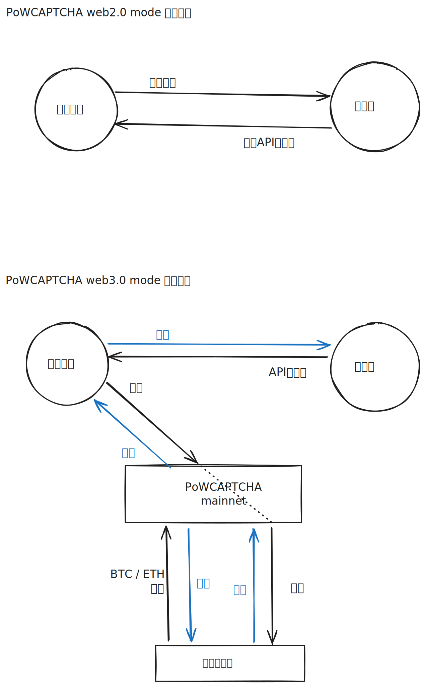

# PoWCAPTCHA-web3.0

PoWCAPTCHA-web3.0 把 web3.0 技术有趣地应用在了 PoWCAPTCHA 上面。

其通过与用户算力挂钩的 “代币”，让设备算力在 PoWCAPTCHA-web3.0 生态内更方便地 “流通”。

本项目的核心在于让用户设备算力可以不仅仅 通过繁复地进行SHA演算 以从网站主那里购买API访问权 ，还能**产生其他实际的价值**以让第三方参与进来，例如 训练ai模型、科学计算、挖矿、为第三方调用[浏览器内置 AI](https://developer.chrome.com/docs/ai/get-started?hl=zh-cn) 等等，如果用户的算力只能拿来为 网站主 这一方服务的话，那么代币所带来的流通性毫无用处。

## 架构一览

## Acknowledgements
该项目由 [FurryR](https://github.com/FurryR) 提出。
